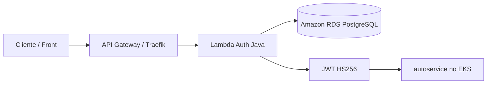

# autoservice-lambda-auth

Função serverless de autenticação por CPF do Tech Challenge, implementada em **Java 21 + AWS Lambda + Maven**.

## Propósito

Este repositório entrega a função que:
- valida o CPF recebido;
- consulta a existência e o status do cliente no **RDS PostgreSQL**;
- emite um **JWT** consumido pelas rotas protegidas da aplicação principal;
- faz deploy automatizado da Lambda via **GitHub Actions**.

## Tecnologias

- Java 21
- AWS Lambda (Java Runtime)
- AWS RDS PostgreSQL
- AWS API Gateway (integração esperada)
- Maven 3.8+
- GitHub Actions (CI/CD)
- JWT (HS256) via JJWT
- JUnit 5 + Mockito
- HikariCP para connection pooling

## Arquitetura do repositório



## Estrutura do projeto

```
src/
├── main/java/com/autoservice/lambda/
│   ├── util/
│   │   └── CpfValidator.java           # Validação de CPF
│   ├── dto/
│   │   ├── AuthRequest.java            # DTO de request
│   │   └── AuthResponse.java           # DTO de response
│   ├── model/
│   │   └── Customer.java               # Model de cliente
│   ├── repository/
│   │   ├── CustomerRepository.java     # Acesso a dados
│   │   └── DatabaseConnection.java     # Pool de conexões
│   ├── service/
│   │   ├── AuthService.java            # Lógica de autenticação
│   │   └── JwtTokenGenerator.java      # Geração de JWT
│   └── AuthHandler.java                # Handler principal
├── test/java/com/autoservice/lambda/
│   ├── util/CpfValidatorTest.java
│   ├── service/
│   │   ├── AuthServiceTest.java
│   │   └── JwtTokenGeneratorTest.java
└── resources/
    └── logback.xml                      # Logging
```

## Build e testes locais

### Pré-requisitos

- Java 21 instalado
- Maven 3.8+

### Build

```bash
# Compilar
mvn clean compile

# Executar testes
mvn test

# Build com shade (gera fat JAR para Lambda)
mvn clean package
```

### Executar testes com cobertura

```bash
mvn clean test jacoco:report
# Relatório em: target/site/jacoco/index.html
```

## Contrato da Lambda

### Evento esperado (JSON)

```json
{
  "body": "{\"cpf\": \"390.533.447-05\"}"
}
```

### Resposta de sucesso (200)

```json
{
  "statusCode": 200,
  "headers": {"Content-Type": "application/json"},
  "body": "{\"token\": \"eyJ0eXAiOiJKV1QiLCJhbGc...\", \"token_type\": \"Bearer\", \"expires_in\": 3600}"
}
```

### Respostas de erro

**CPF faltando (400):**
```json
{
  "statusCode": 400,
  "body": "{\"message\": \"CPF é obrigatório.\"}"
}
```

**CPF inválido (400):**
```json
{
  "statusCode": 400,
  "body": "{\"message\": \"CPF inválido.\"}"
}
```

**Cliente não encontrado (404):**
```json
{
  "statusCode": 404,
  "body": "{\"message\": \"Cliente não encontrado.\"}"
}
```

**Cliente inativo (403):**
```json
{
  "statusCode": 403,
  "body": "{\"message\": \"Cliente inativo ou bloqueado.\"}"
}
```

## Claims do JWT

O token gerado contém os seguintes claims:

```json
{
  "sub": "39053344705",           // CPF do cliente
  "cpf": "39053344705",            // CPF do cliente
  "customer_status": "ATIVO",      // Status: ATIVO, INATIVO
  "roles": ["CUSTOMER"],           // Papéis do cliente
  "kid": "v1",                     // Versão/chave ativa para rotação
  "iss": "autoservice-auth",       // Issuer
  "iat": 1234567890,               // Issued at (timestamp)
  "exp": 1234567890                // Expiration (timestamp)
}
```

## Variáveis de ambiente

| Variável | Padrão | Descrição |
|----------|--------|-----------|
| `JWT_SECRET` | `change-me-in-production` | Secret para assinar JWT (mínimo 32 bytes) |
| `JWT_ISSUER` | `autoservice-auth` | Issuer no JWT |
| `JWT_EXPIRES_SECONDS` | `3600` | Expiração do token em segundos |
| `JWT_KEY_ID` | `v1` | Identificador da chave ativa para rotação |
| `ALLOW_INSECURE_JWT_SECRET` | `false` | Somente local: permite fallback inseguro |
| `DB_HOST` | `localhost` | Host do RDS PostgreSQL |
| `DB_PORT` | `5432` | Porta do RDS PostgreSQL |
| `DB_NAME` | `autoservice` | Nome do banco de dados |
| `DB_USER` | `postgres` | Usuário do banco de dados |
| `DB_PASSWORD` | (vazio) | Senha do banco de dados |

## Observabilidade e monitoramento

### Logs estruturados JSON

- O `logback.xml` foi configurado para saída **JSON**.
- Campos de correlação registrados via MDC:
  - `request_id` (AWS request id),
  - `correlation_id` (header `X-Correlation-Id`),
  - `cpf_hash` (SHA-256 truncado, sem expor CPF),
  - `duration_ms`,
  - `cold_start`.
- O `X-Correlation-Id` é devolvido no header da resposta.

### Padrão mínimo de monitoramento da função

- **Latência:** `duration_ms` p95/p99.
- **Taxa de erro:** proporção de `statusCode >= 400`.
- **Tempo de execução:** distribuição por endpoint de autenticação.
- **Cold starts:** percentual por janela de tempo.

### Integração Datadog/New Relic

Este repositório já expõe os dados necessários em logs estruturados para ingestão.  
A integração final com Datadog/New Relic deve ser concluída no ambiente (forwarder/agent), conforme padrão do grupo.

## Integração com RDS

A Lambda consulta a tabela `cliente` do RDS:

```sql
CREATE TABLE cliente (
    cpf VARCHAR(14) PRIMARY KEY,
    nome VARCHAR(150) NOT NULL,
    email VARCHAR(100) UNIQUE NOT NULL,
    status VARCHAR(20) DEFAULT 'ATIVO',  -- ATIVO, INATIVO, BLOQUEADO
    ...
);
```

A classe `DatabaseConnection` usa **HikariCP** para gerenciar pool de conexões.

## Testes

### Executar todos os testes

```bash
mvn test
```

### Executar teste específico

```bash
mvn test -Dtest=CpfValidatorTest
```

## CI/CD

O workflow `.github/workflows/ci-cd.yml` executa:

- `pull_request` para `homolog` e `prod`: compile + testes + artefatos;
- `push` em `homolog`: build do fat JAR, deploy e smoke test da Lambda em homolog;
- `push` em `prod`: build do fat JAR, deploy e smoke test da Lambda em produção.

### Secrets esperados no GitHub

| Secret | Uso |
| --- | --- |
| `AWS_ROLE_TO_ASSUME` | Role IAM para deploy com OIDC |
| `AWS_REGION` | Região AWS |
| `LAMBDA_FUNCTION_NAME` | Nome da função Lambda |
| `JWT_SECRET` | Segredo do token JWT |
| `JWT_ISSUER` | Issuer do token |
| `JWT_EXPIRES_SECONDS` | Expiração do token |
| `JWT_KEY_ID` | Versão da chave JWT para rotação |
| `DB_HOST` | Host do RDS |
| `DB_PORT` | Porta do RDS |
| `DB_NAME` | Nome do banco |
| `DB_USER` | Usuário do banco |
| `DB_PASSWORD` | Senha do banco |

## Links de deploy por ambiente

- Homolog (invoke URL): `https://<api-gateway-homolog>/auth`
- Produção (invoke URL): `https://<api-gateway-prod>/auth`

## Checklist final por ambiente

### Homolog
- [ ] Pipeline CI completa na branch `homolog`
- [ ] Artefato JAR gerado
- [ ] Deploy da Lambda concluído
- [ ] Smoke test da função retornando token para CPF válido
- [ ] Cliente inativo retornando `403`

### Produção
- [ ] Pipeline CI completa na branch `prod`
- [ ] Artefato JAR gerado
- [ ] Deploy da Lambda concluído
- [ ] Smoke test da função retornando token para CPF válido
- [ ] Cliente inativo retornando `403`

## Deploy para AWS Lambda

```bash
# Build
mvn clean package

# Upload para Lambda
aws lambda update-function-code \
  --function-name autoservice-lambda-auth \
  --zip-file fileb://target/lambda-auth-1.0.0.jar \
  --region us-east-1
```

## Troubleshooting

### "Cliente não encontrado"
- Validar que o CPF está correto (11 dígitos)
- Confirmar se o cliente existe no banco de dados

### "Erro ao conectar com banco"
- Validar variáveis de ambiente `DB_*`
- Testar conexão com RDS

## Wiring com os outros repositórios

- **`autoservice-infra-db`**: fornece `DB_HOST`, `DB_PORT`, `DB_NAME` e `DB_USER` via outputs.
- **`autoservice-infra-k8s`**: fornece a topologia de rede/gateway usada pela solução.
- **`autoservice`**: consome o `JWT_ISSUER` e o `JWT_SECRET` para validar o token do cliente.

## Swagger / Postman

Este repositório não expõe API HTTP própria fora do runtime serverless. O contrato protegido está documentado no repositório **`autoservice`**:

- Swagger: `autoservice/README.md`
- Postman: `autoservice/Autoservice API.postman_collection.json`

## Dockerfile

Não se aplica a este repositório, porque o artefato de entrega é um **JAR para AWS Lambda**.

## Documentação arquitetural complementar

- ADR JWT: `docs/adr/ADR-001-jwt-auth-strategy.md`
- RFC observabilidade e segurança operacional: `docs/rfc/RFC-001-observability-and-secrets.md`
- Diagrama de sequência de autenticação: `docs/architecture/auth-sequence.md`

## Observações de produção

- Use **JWT_SECRET** forte e armazenado em segredo do GitHub/AWS.
- Configure VPC/security groups para acesso ao RDS.
- Ajuste timeout da Lambda para 10-15s.
- Valide o endpoint final exposto pelo gateway antes da gravação do vídeo de entrega.
