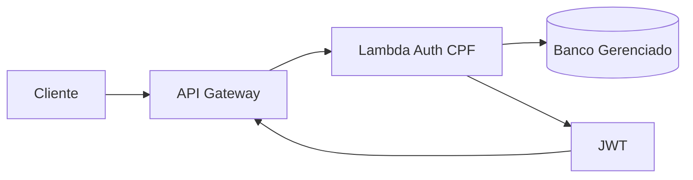

# autoservice-lambda-auth

Function Serverless de autenticacao por CPF para o Tech Challenge POS TECH.

## Proposito

Este repositorio contem a Lambda responsavel por:
- validar CPF;
- consultar a existencia/status do cliente;
- emitir JWT para consumo de rotas protegidas via API Gateway.

## Tecnologias

- Python 3.12
- AWS Lambda
- AWS API Gateway (integracao esperada)
- GitHub Actions (CI/CD)
- JWT (HS256)

## Execucao local

1. Instale as dependencias:
   ```bash
   pip install -r requirements.txt pytest
   ```
2. Execute os testes:
   ```bash
   pytest -q
   ```

## Contrato da Lambda

Evento esperado:

```json
{
  "body": "{\"cpf\":\"390.533.447-05\"}"
}
```

Resposta de sucesso:

```json
{
  "statusCode": 200,
  "body": "{\"token\":\"<jwt>\",\"token_type\":\"Bearer\",\"expires_in\":3600}"
}
```

## Variaveis de ambiente

- `JWT_SECRET` (obrigatoria em producao)
- `JWT_ISSUER` (padrao: `autoservice-auth`)
- `JWT_EXPIRES_SECONDS` (padrao: `3600`)

## CI/CD

- PR para `main`: executa testes.
- Push em `homolog` e `main`: executa testes e deploy automatico da Lambda.

Secrets esperados no GitHub:
- `AWS_ROLE_TO_ASSUME`
- `AWS_REGION`
- `LAMBDA_FUNCTION_NAME`

## Protecao de branch

Configurar no GitHub:
- `main` protegida, sem commit direto;
- merge apenas por Pull Request;
- revisao obrigatoria antes de merge.

## Diagrama (escopo deste repositorio)



## Swagger/Postman

Definir e publicar no repositorio da aplicacao/API principal.
