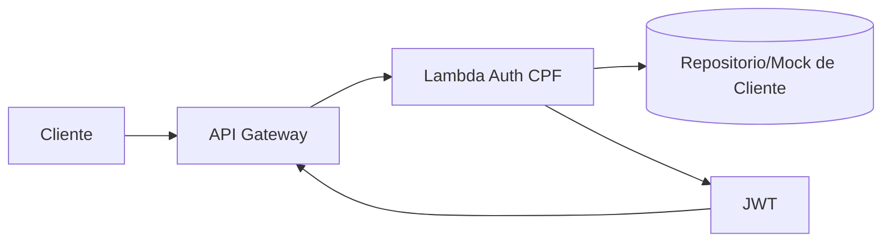

# autoservice-lambda-auth

Funcao Serverless de autenticacao por CPF para o Tech Challenge POS TECH.

## Proposito

Este repositorio contem a Lambda responsavel por:
- validar o CPF do cliente;
- consultar a existencia e o status do cliente;
- emitir JWT para consumo em rotas protegidas via API Gateway.

## Tecnologias

- Python 3.11
- AWS Lambda
- AWS API Gateway
- Serverless Framework
- GitHub Actions (CI/CD)
- JWT (HS256)

## Estrutura do repositorio

- `src/lambda_function.py`: handler da Lambda
- `src/cpf.py`: validacao do CPF
- `src/repository.py`: leitura do cliente em memoria (mock inicial)
- `serverless.yml`: IaC para deploy na AWS
- `swagger.yaml`: contrato OpenAPI para a Lambda
- `.github/workflows/ci.yml`: pipeline de integracao e deploy

## Execucao local

1. Crie e ative um ambiente virtual:
   ```bash
   python -m venv .venv
   source .venv/bin/activate
   ```
   No Windows PowerShell:
   ```powershell
   python -m venv .venv
   .\.venv\Scripts\Activate.ps1
   ```

2. Instale as dependencias:
   ```bash
   pip install -r requirements.txt pytest
   ```

3. Execute os testes:
   ```bash
   pytest -q
   ```

4. Teste a funcao localmente com um evento de exemplo:
   ```python
   import json
   from src.lambda_function import handler

   event = {"body": json.dumps({"cpf": "390.533.447-05"})}
   response = handler(event, None)
   print(response)
   ```

## Contrato da Lambda

Endpoint exposto pelo Serverless no API Gateway:

- POST `/auth/cpf`

Evento esperado:

```json
{
  "body": "{\"cpf\":\"390.533.447-05\"}"
}
```

Resposta de sucesso:

```json
{
  "statusCode": 200,
  "body": "{\"token\":\"<jwt>\",\"token_type\":\"Bearer\",\"expires_in\":3600}"
}
```

Resposta de erro de CPF invalido:

```json
{
  "statusCode": 400,
  "body": "{\"message\":\"CPF invalido.\"}"
}
```

Resposta para cliente inativo:

```json
{
  "statusCode": 403,
  "body": "{\"message\":\"Cliente inativo.\"}"
}
```

## Variaveis de ambiente

- `JWT_SECRET` (obrigatoria em producao)
- `JWT_ISSUER` (padrao: `autoservice-auth`)
- `JWT_EXPIRES_SECONDS` (padrao: `3600`)
- `AWS_REGION` (definida no ambiente da AWS / GitHub Actions)

## CI/CD

- Pull request para `main`: executa testes.
- Push em `main` ou `homolog`: executa testes, empacota a Lambda e faz o deploy automatico via Serverless Framework.
- O pipeline usa `serverless package` e `serverless deploy` com secrets do GitHub.

Secrets esperados no GitHub:
- `AWS_ROLE_TO_ASSUME`
- `AWS_REGION`
- `JWT_SECRET`
- `JWT_ISSUER` (opcional)
- `JWT_EXPIRES_SECONDS` (opcional)

## Deploy com Serverless

1. Instale as dependencias do Node.js:
   ```bash
   npm install
   ```

2. Configure as variaveis de ambiente da AWS e do JWT:
   ```bash
   export AWS_REGION=us-east-1
   export JWT_SECRET=seu-secret
   export JWT_ISSUER=autoservice-auth
   export JWT_EXPIRES_SECONDS=3600
   ```

3. Faça o deploy:
   ```bash
   npx serverless deploy --stage dev
   ```

## Protecao de branch

Configurar no GitHub:
- `main` protegida, sem commit direto;
- merge apenas por Pull Request;
- revisao obrigatoria antes de merge.

## Diagrama (escopo deste repositorio)



## Swagger / Postman

O contrato OpenAPI da API esta em `swagger.yaml` e pode ser importado em ferramentas como Swagger Editor, Postman ou Insomnia.
