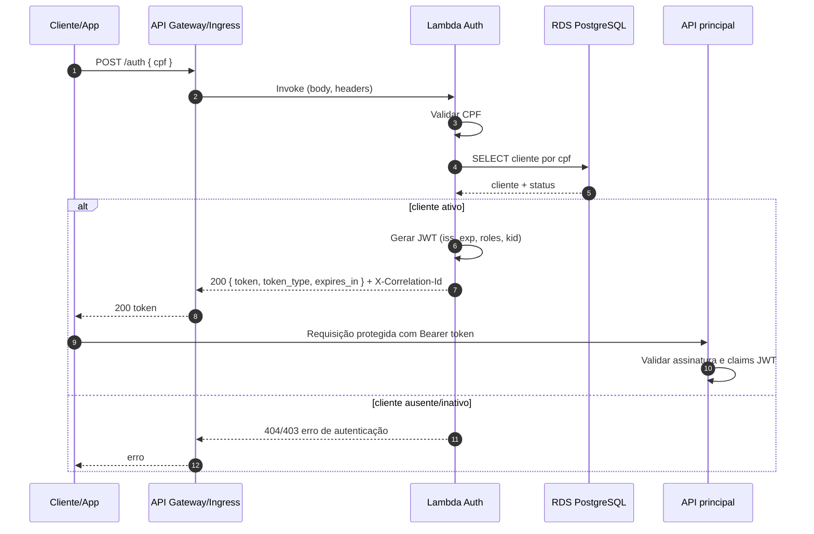

# Diagrama de sequência - autenticação CPF -> Lambda -> DB -> JWT

```mermaid
sequenceDiagram
    autonumber
    participant C as Cliente/App
    participant G as API Gateway/Ingress
    participant L as Lambda Auth
    participant D as RDS PostgreSQL
    participant A as API principal

    C->>G: POST /auth { cpf }
    G->>L: Invoke (body, headers)
    L->>L: Validar CPF
    L->>D: SELECT cliente por cpf
    D-->>L: cliente + status
    alt cliente ativo
        L->>L: Gerar JWT (iss, exp, roles, kid)
        L-->>G: 200 { token, token_type, expires_in } + X-Correlation-Id
        G-->>C: 200 token
        C->>A: Requisição protegida com Bearer token
        A->>A: Validar assinatura e claims JWT
    else cliente ausente/inativo
        L-->>G: 404/403 erro de autenticação
        G-->>C: erro
    end
```
